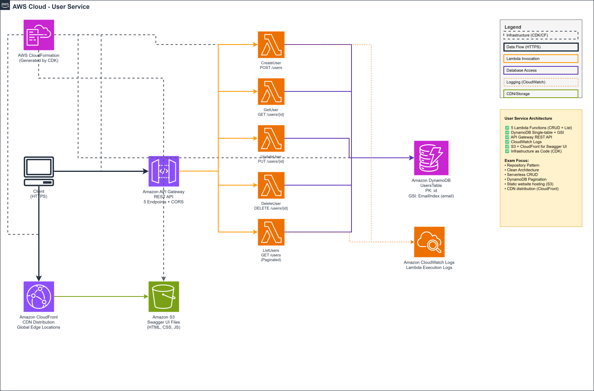

# User Service - Microservicio de Gestión de Usuarios

Primer microservicio del proyecto de certificación AWS Certified Developer Associate, implementando Clean Architecture con el patrón Repository.

## 🎯 Objetivo

Microservicio serverless para gestión de usuarios (CRUD completo) utilizando:

- **AWS Lambda** - Funciones serverless
- **API Gateway** - REST API
- **DynamoDB** - Base de datos NoSQL
- **CDK** - Infrastructure as Code

## 🏗️ Arquitectura

### Diagrama de Arquitectura AWS



**Componentes principales:**

- **5 Lambda Functions**: CreateUser, GetUser, UpdateUser, DeleteUser, ListUsers
- **API Gateway**: REST API con 5 endpoints y CORS habilitado
- **DynamoDB**: Tabla UsersTable con GSI EmailIndex
- **CloudWatch Logs**: Logging centralizado de todas las Lambdas
- **CloudFormation**: Infrastructure as Code generada por CDK
- **Swagger UI**: Documentación interactiva en `/api-docs`

### Clean Architecture

```
┌─────────────────────────────────────────────┐
│           Clean Architecture                │
├─────────────────────────────────────────────┤
│  Domain Layer (Entities, Repositories)      │
│             ↑                                │
│  Application Layer (Use Cases, DTOs)        │
│             ↑                                │
│  Infrastructure (Lambda, DynamoDB, HTTP)    │
└─────────────────────────────────────────────┘
```

### Principios

- ✅ Separación de capas (Domain → Application → Infrastructure)
- ✅ Dependency Inversion (interfaces en domain)
- ✅ Single Responsibility Principle
- ✅ Repository Pattern para abstracción de datos

## 📁 Estructura del Proyecto

```
user-service/
├── src/
│   ├── domain/              # Lógica de negocio pura
│   ├── application/         # Casos de uso
│   ├── infrastructure/      # AWS Lambda, DynamoDB, HTTP
│   └── shared/              # Utilidades compartidas
├── infrastructure/          # CDK Infrastructure as Code
├── tests/                   # Tests unitarios e integración
└── docs/                    # Documentación y OpenAPI spec
```

## 🚀 Comenzar

### Prerequisitos

- Node.js 20.x
- pnpm 8.x
- AWS CLI configurado
- AWS CDK CLI
- AWS SAM CLI (para testing local)

### Instalación

```bash
# Clonar e instalar dependencias
cd user-service
pnpm install
```

### Desarrollo

```bash
# Compilar TypeScript
pnpm run build

# Ejecutar tests
pnpm run test

# Ejecutar tests con coverage
pnpm run test:coverage

# Linting
pnpm run lint
pnpm run lint:fix

# Generar documentación OpenAPI/Swagger
pnpm run swagger:generate
```

### Testing Local con SAM

```bash
# Compilar y generar template CDK
pnpm run sam:build

# Iniciar API Gateway localmente (http://localhost:3000)
pnpm run sam:local:api

# Invocar función Lambda específica
pnpm run sam:local:invoke -- -e events/test.json FunctionName
```

**Nota**: SAM CLI usa el template CloudFormation generado por CDK (`cdk.out/`), no requiere un `template.yaml` separado.

### Deployment

```bash
# Sintetizar template de CloudFormation
pnpm run cdk:synth

# Deploy a desarrollo
pnpm run cdk:deploy:dev

# Deploy a producción
pnpm run cdk:deploy:prod

# Destruir stack de desarrollo
pnpm run cdk:destroy:dev
```

## 📋 API Endpoints

### Documentación Interactiva

Después del deploy, accede a Swagger UI en: `https://{API_URL}/api-docs`

### Endpoints

| Método | Ruta        | Descripción                      |
| ------ | ----------- | -------------------------------- |
| POST   | /users      | Crear un nuevo usuario           |
| GET    | /users      | Listar usuarios (con paginación) |
| GET    | /users/{id} | Obtener usuario por ID           |
| PUT    | /users/{id} | Actualizar usuario               |
| DELETE | /users/{id} | Eliminar usuario                 |

### Ejemplo de Request

```bash
# Crear usuario
curl -X POST https://API_URL/users \
  -H "Content-Type: application/json" \
  -d '{
    "email": "john.doe@example.com",
    "firstName": "John",
    "lastName": "Doe"
  }'
```

## 🧪 Testing

El proyecto mantiene un coverage mínimo de **80%** en todas las métricas utilizando **BDD (Behavior-Driven Development)** con **Gherkin** y **jest-cucumber**.

### Enfoque BDD con Gherkin

Los tests están escritos en formato **Given-When-Then** utilizando `jest-cucumber`, lo que permite:

- ✅ Tests más legibles y descriptivos
- ✅ Especificaciones ejecutables en lenguaje natural
- ✅ Colaboración entre desarrolladores, QA y stakeholders
- ✅ Documentación viva del comportamiento del sistema

**Ejemplo de test con Gherkin:**

```typescript
test("Create user with valid data", ({ given, when, then }) => {
  given("valid user data", () => {
    // Arrange
  });

  when("I create the user", () => {
    // Act
  });

  then("the user should be created successfully", () => {
    // Assert
  });
});
```

### Test Fixtures

Los tests utilizan **fixtures centralizadas** con **Builder** y **Factory patterns** para evitar duplicación de código:

- Datos de test reutilizables en `tests/fixtures/`
- Builder pattern para crear objetos de test complejos
- Factory methods para casos de uso comunes

```bash
# Run all tests
pnpm run test

# Watch mode
pnpm run test -- --watch

# Coverage report
pnpm run test:coverage
```

## 📚 Conceptos del Examen AWS

Este microservicio cubre los siguientes dominios del examen:

### Domain 1.1: Develop code for applications on AWS

- Lambda function handlers
- Dependency injection pattern
- Error handling en Lambda
- Environment variables

### Domain 1.3: Use data stores in development

- DynamoDB single-table design
- Primary keys y Sort keys
- Global Secondary Index (GSI)
- Query vs Scan operations
- Conditional writes

### Domain 1.4: Develop code for APIs

- REST API con API Gateway
- Lambda integration
- HTTP status codes
- CORS configuration
- API Documentation con OpenAPI/Swagger

## 🛠️ Tecnologías

- **Runtime**: Node.js 20.x
- **Lenguaje**: TypeScript 5.x
- **Framework de Testing**: Jest + jest-cucumber (BDD)
- **Linting**: ESLint
- **Validación**: Zod
- **IaC**: AWS CDK
- **Local Testing**: AWS SAM CLI
- **API Docs**: OpenAPI 3.0 + Swagger UI

## 📖 Documentación Adicional

- [PLAN.md](PLAN.md) - Plan de implementación completo
- [ARCHITECTURE.md](ARCHITECTURE.md) - Decisiones arquitectónicas (próximamente)
- [docs/openapi.json](docs/openapi.json) - Especificación OpenAPI (generada)

## 📝 Scripts Disponibles

| Script             | Descripción                                  |
| ------------------ | -------------------------------------------- |
| `build`            | Compilar TypeScript a JavaScript             |
| `test`             | Ejecutar tests                               |
| `test:coverage`    | Tests con reporte de coverage                |
| `lint`             | Verificar código con ESLint                  |
| `lint:fix`         | Corregir problemas de linting                |
| `swagger:generate` | Generar especificación OpenAPI               |
| `sam:build`        | Compilar y generar template CDK              |
| `sam:local:api`    | Iniciar API Gateway local (puerto 3000)      |
| `sam:local:invoke` | Invocar función Lambda específica localmente |
| `cdk:synth`        | Sintetizar template CloudFormation           |
| `cdk:deploy:dev`   | Deploy a entorno de desarrollo               |
| `cdk:deploy:prod`  | Deploy a entorno de producción               |
| `cdk:destroy:dev`  | Destruir stack de desarrollo                 |
| `clean`            | Limpiar archivos generados                   |

## 🤝 Contribuir

Este proyecto es parte de un estudio para la certificación AWS Developer Associate.
Es el template base que se replicará para los 9 microservicios restantes.

## 📄 Licencia

MIT

---

**Parte de**: Proyecto de Certificación AWS Certified Developer Associate
**Microservicio**: 1 de 10
**Patrón**: Repository Pattern + Clean Architecture
